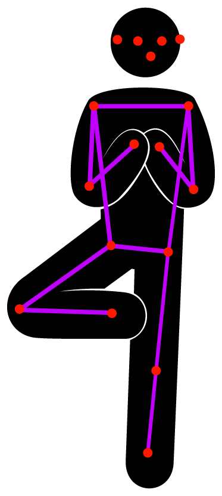

# Detecting Human Body Poses in an Image

Locate people and the stance of their bodies by analyzing an image with a PoseNet model.  

## Overview

This sample project demonstrates how to use a PoseNet model to augment a video stream from a camera. PoseNet models detect 17 different body parts or joints: eyes, ears, nose, shoulders, hips, elbow, knees, wrists, and ankles. Collectively these joints form a pose.

  

The sample finds the locations of the 17 joints for each person in the image and draws a wireframe pose on top of them.  
- Note: Run this sample on a device with iOS 13 or later, or iPadOS 13 or later.  

## Configure the Capture Session

The sample starts by getting an image from the device’s built-in camera using an [`AVCaptureSession`](https://developer.apple.com/documentation/avfoundation/avcapturesession) (see [Setting Up a Capture Session](https://developer.apple.com/documentation/avfoundation/cameras_and_media_capture/setting_up_a_capture_session)).  

``` swift
if captureSession.isRunning {
    captureSession.stopRunning()
}

captureSession.beginConfiguration()

captureSession.sessionPreset = .vga640x480

try setCaptureSessionInput()

try setCaptureSessionOutput()

captureSession.commitConfiguration()
```

## Acquire the Captured Image

A video capture session sends each image to the [`captureOutput(_:didOutput:from:)`](https://developer.apple.com/documentation/avfoundation/avcaptureaudiodataoutputsamplebufferdelegate/1386039-captureoutput) method of the [`VideoCapture`](x-source-tag://VideoCapture) class, where the app converts the received [`CMSampleBuffer`](https://developer.apple.com/documentation/coremedia/cmsamplebuffer) into a [`CGImage`](https://developer.apple.com/documentation/coregraphics/cgimage) before passing it to the delegate assigned to the [`VideoCapture`](x-source-tag://VideoCapture) object.

``` swift
// Attempt to lock the image buffer to gain access to its memory.
guard CVPixelBufferLockBaseAddress(pixelBuffer, .readOnly) == kCVReturnSuccess
    else {
        return
}

// Create Core Graphics image placeholder.
var image: CGImage?

// Create a Core Graphics bitmap image from the pixel buffer.
VTCreateCGImageFromCVPixelBuffer(pixelBuffer, options: nil, imageOut: &image)

// Release the image buffer.
CVPixelBufferUnlockBaseAddress(pixelBuffer, .readOnly)

DispatchQueue.main.sync {
    delegate.videoCapture(self, didCaptureFrame: image)
}
```

## Prepare the Input for the PoseNet Model

After receiving the captured image, the app wraps it in an instance of [`PoseNetInput`](x-source-tag://PoseNetInput), a custom feature provider, to resize the image to the specified size.  

``` swift
// Wrap the image in an instance of PoseNetInput to have it resized
// before being passed to the PoseNet model.
let input = PoseNetInput(image: image, size: self.modelInputSize)
```

## Pass the Input to the PoseNet Model

The sample app then proceeds to pass the input to the PoseNet’s [`prediction`](https://developer.apple.com/documentation/coreml/mlmodel/2880280-prediction) function to obtain its outputs, which the app uses to detect poses.  

``` swift
guard let prediction = try? self.poseNetMLModel.prediction(from: input) else {
    return
}
```

Next, the sample app wraps the PoseNet model outputs in an instance of [`PoseNetOutput`](x-source-tag://PoseNetOutput), along with the model's input size and output stride, before passing it back to the assigned delegate for analysis.  

``` swift
let poseNetOutput = PoseNetOutput(prediction: prediction,
                                  modelInputSize: self.modelInputSize,
                                  modelOutputStride: self.outputStride)

DispatchQueue.main.async {
    self.delegate?.poseNet(self, didPredict: poseNetOutput)
}
```

## Analyze the PoseNet Output to Locate Joints

The sample uses one of two algorithms to locate the joints of either one person or multiple persons. The single-person algorithm, the simplest and fastest, inspects the model’s outputs to locate the most prominent joints in the image and uses these joints to construct a single pose.  

``` swift
var pose = Pose()

// For each joint, find its most likely position and associated confidence
// by querying the heatmap array for the cell with the greatest
// confidence and using this to compute its position.
pose.joints.values.forEach { joint in
    configure(joint: joint)
}

// Compute and assign the confidence for the pose.
pose.confidence = pose.joints.values
    .map { $0.confidence }.reduce(0, +) / Double(Joint.numberOfJoints)

// Map the pose joints positions back onto the original image.
pose.joints.values.forEach { joint in
    joint.position = joint.position.applying(modelToInputTransformation)
}

return pose
```

The multiple-person algorithm first identifies a set of candidate root joints as starting points. It uses these root joints to find neighboring joints and repeats the process until it has located all 17 joints of each person. For example, the algorithm may find a left knee with a high confidence, and then search for its adjacent joints, the left ankle and left hip.  

``` swift
var detectedPoses = [Pose]()

// Iterate through the joints with the greatest confidence, referred to here as
// candidate roots, using each as a starting point to assemble a pose.
for candidateRoot in candidateRoots {
    // Ignore any candidates that are in the proximity of joints of the
    // same type and have already been assigned to an existing pose.
    let maxDistance = configuration.matchingJointDistance
    guard !detectedPoses.contains(candidateRoot, within: maxDistance) else {
        continue
    }

    var pose = assemblePose(from: candidateRoot)

    // Compute the pose's confidence by dividing the sum of all
    // non-overlapping joints, from existing poses, by the total
    // number of joints.
    pose.confidence = confidence(for: pose, detectedPoses: detectedPoses)

    // Ignore any pose that has a confidence less than the assigned threshold.
    guard pose.confidence >= configuration.poseConfidenceThreshold else {
        continue
    }

    detectedPoses.append(pose)

    // Exit early if enough poses have been detected.
    if detectedPoses.count >= configuration.maxPoseCount {
        break
    }
}

// Map the pose joints positions back onto the original image using
// the pre-computed transformation matrix.
detectedPoses.forEach { pose in
    pose.joints.values.forEach { joint in
        joint.position = joint.position.applying(modelToInputTransformation)
    }
}

return detectedPoses
```

## Visualize the Detected Poses

For each detected pose, the sample app draws a wireframe over the input image, connecting the lines between the joints and then drawing circles for the joints themselves.  



``` swift
let dstImageSize = CGSize(width: frame.width, height: frame.height)
let dstImageFormat = UIGraphicsImageRendererFormat()

dstImageFormat.scale = 1
let renderer = UIGraphicsImageRenderer(size: dstImageSize,
                                       format: dstImageFormat)

let dstImage = renderer.image { rendererContext in
    // Draw the current frame as the background for the new image.
    draw(image: frame, in: rendererContext.cgContext)

    for pose in poses {
        // Draw the segment lines.
        for segment in PoseImageView.jointSegments {
            let jointA = pose[segment.jointA]
            let jointB = pose[segment.jointB]

            guard jointA.isValid, jointB.isValid else {
                continue
            }

            drawLine(from: jointA,
                     to: jointB,
                     in: rendererContext.cgContext)
        }

        // Draw the joints as circles above the segment lines.
        for joint in pose.joints.values.filter({ $0.isValid }) {
            draw(circle: joint, in: rendererContext.cgContext)
        }
    }
}
```
